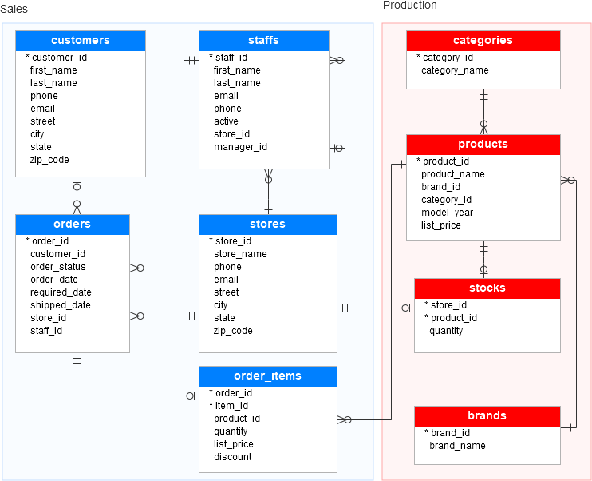
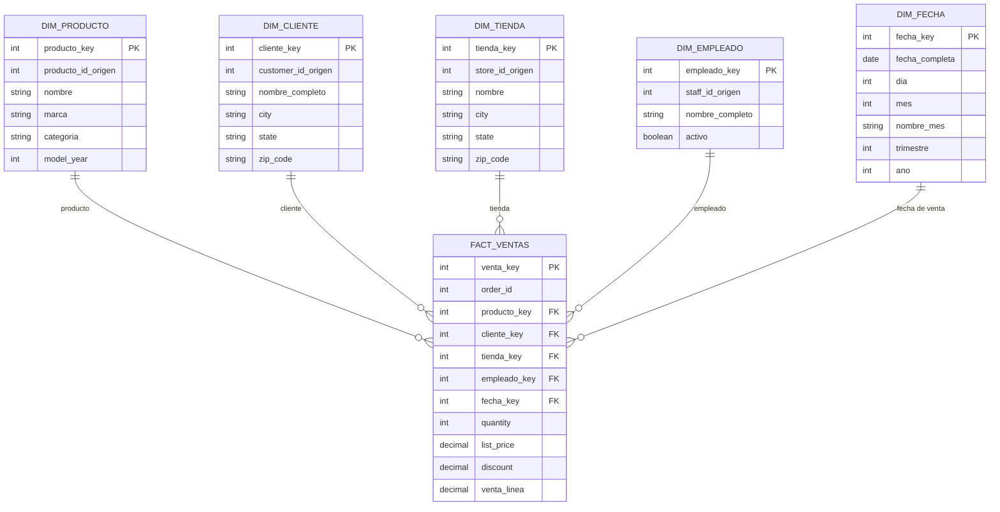

# Proyecto Final - BikeStore

Franco Quiros - 304850621

Fernanda Porras - 116940902

## Base de Datos - BikeStore

## ETL

Extraccion de datos de BikeStore -> BikeStoreStage -> BikeStoreDW

**Dimensiones:**

- Clientes
- Tiendas
- Empleados
- Fecha
- Productos
- Órdenes

Propuesta DW

